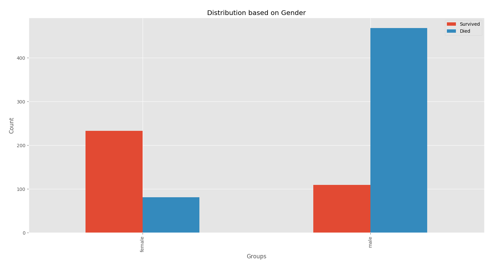
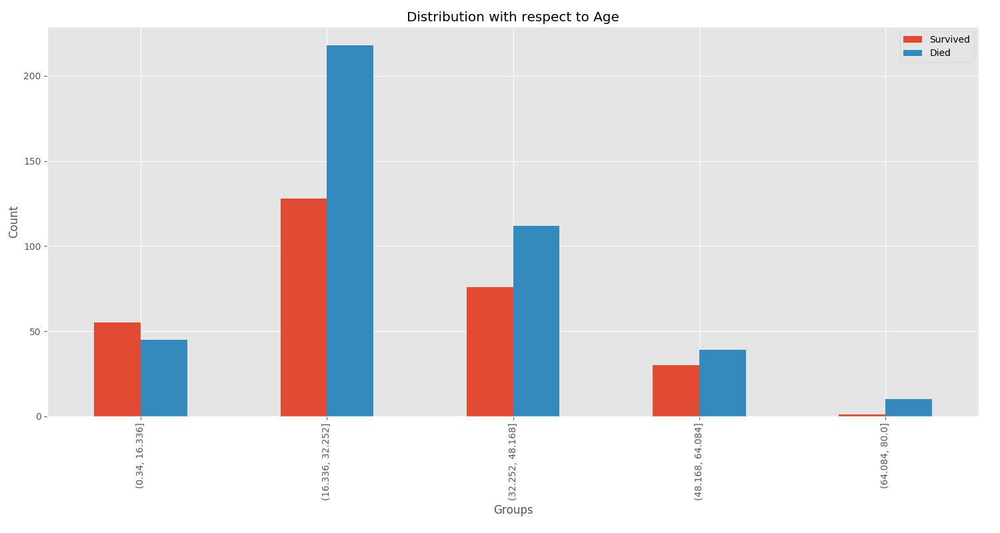
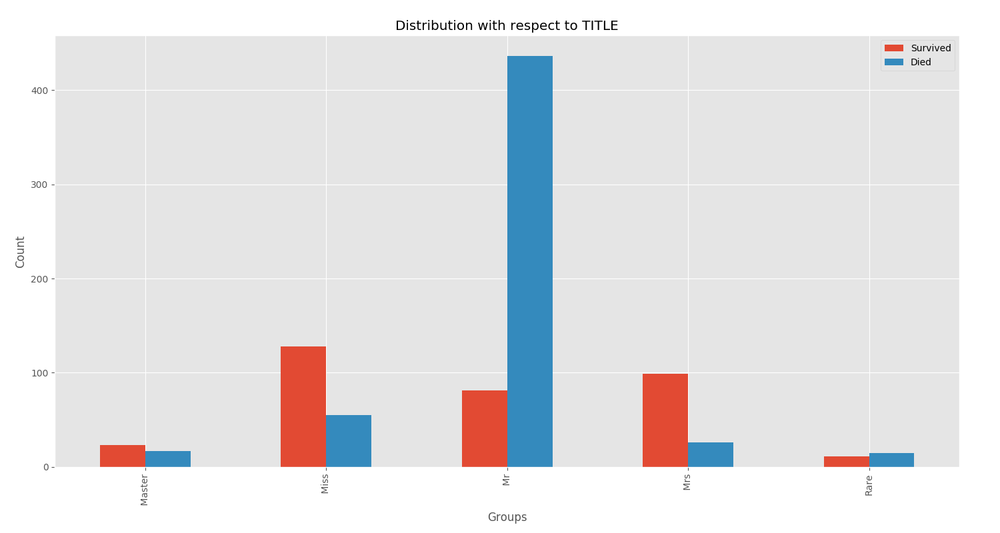
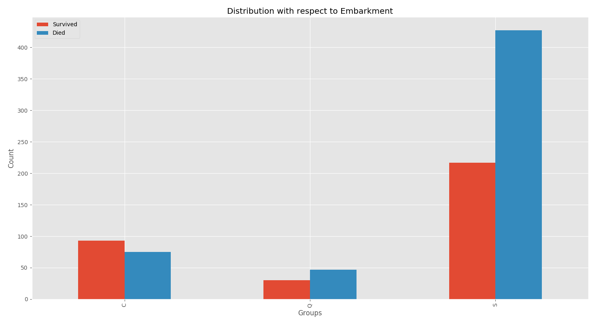

# Titanic Problem

In this challenge from Kaggle, participants were asked to complete the analysis of what sorts of people were likely to survive. In particular, participants were asked to apply the tools of machine learning to predict which passengers survived the tragedy.
# Approach to Solving the Problem
  - Reading the Datasets Provided
  - Bringing out important features by **Visualizing the Data**
  - **Cleaning** the dataset
  - **Normalizing** the dataset and creating features
  - **Fitting** the features into the Classifier
  - **Predicting** the results using the Trained Classifier
### About the Dataset
##### **Dataset Parameters :**
###
| Attribute | Description |
| ------ | ------ |
| PassengerId| Used for indexing |
| Survived | Whether the passenger survived or not |
| Pclass | Class of the ticket |
| Name | Name of the passenger |
| Sex | Gender male or female |
| Age | Age of the Passenger |
| SibSp | Number of Siblings of the passenger |
| Parch | Number of Children and Parents of the passenger |
| Ticket |Ticket number|
| Fare | Ticket price |
| Cabin | Cabin number |
| Embarked | Place of Embarkment |

## Visualization
Grouping the passengers in each **Category** and visualizing the count of Passengers *Survived* and *Died*
#### Gender
  - Male
  - Female


#### Ticket Class
  - (1,2,3)


#### Age
  - (0 to 16) 
  - (17 to 32)
  - (33 to 48)
  - (49 to 64)


#### Title
  - Mr
  - Master
  - Miss
  - Mrs
  - Rare


#### Fare
  - (0 to 8) 
  - (9 to 11)
  - (12 to 22)
  - (22 to 40)
  - (41 to 513)


#### Embarkment
  - (S,Q,C)


#### Family
  - (1,2,3,4,5,6,7,8,9,10,11)


## Data Processing 
The dataset provided needs to be cleaned and normalized in order to feed them into the classifier.
  - **Age** is mapped into **Age-Groups**
  ```sh
df["age_groups"]=pd.cut(df["Age"],5)
df.loc[ df['Age'] <= 16, 'Age'] = 0
df.loc[(df['Age'] > 16) & (df['Age'] <= 32), 'Age'] = 1
df.loc[(df['Age'] > 32) & (df['Age'] <= 48), 'Age'] = 2
df.loc[(df['Age'] > 48) & (df['Age'] <= 64), 'Age'] = 3
df.loc[ df['Age'] > 64, 'Age'] = 4
  ```
  - **Gender** is mapped as { 'male' : 1 , 'female' : 0 }
  ```sh
df['Gender']=list(map(lambda x: int(x=='male'),np.array(df['Sex'])))
  ```
  - **Fare** is mapped into **Fare-Groups**
```sh
df["fare_groups"]=pd.qcut(df["Fare"],5)
df.loc[df['Fare']<= 8,"Fare"]=0
df.loc[(df['Fare']>8) & (df['Fare']<=11),"Fare"]=1
df.loc[(df['Fare']>11) & (df['Fare']<=22),"Fare"]=2
df.loc[(df['Fare']>22) & (df['Fare']<=40),"Fare"]=3
df.loc[(df['Fare']>40) & (df['Fare']<=513),"Fare"]=4
```
  - **Embarkment** is mapped as { 'S' : 0 , 'Q' : 1 , 'C' : 2 }
```sh
Embarks={'S':0 ,'C':1 ,'Q':2 ,'0':0}
df['Embarked']=[ Embarks[str(i)] for i in df['Embarked'] ]
```
## Classification
Feeding the Featureset into a classification model to train the Classifier
```sh
from sklearn import < Classifier Class >
...
clf = < Classifier Class >.< Classifier Name >(< Parameters >)
clf.fit(< Features >,< Label >)
Prediction = clf.predict(< Test Features >)
```
#### Types of Classifier used :-
- Logistic Regression
- K Nearest Neighbors
- Support Vector Classifier
- Decision Tree
- Random Forest
